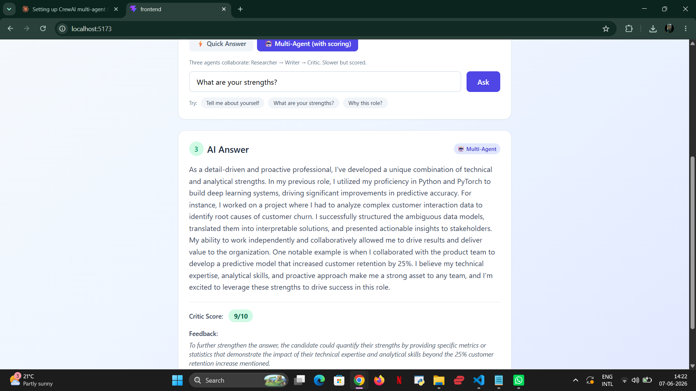

# InterviewIQ — AI-Powered Interview Copilot

> A multi-agent interview preparation tool that grounds answers in your actual resume using RAG, then critiques and scores them.

**🔗 Live Demo:** [interviewiq-seven.vercel.app](https://interviewiq-seven.vercel.app)
**🔗 Backend API:** [interviewiq-3po0.onrender.com](https://interviewiq-3po0.onrender.com)

---



---

## What it does

Upload your resume, ask an interview question, and get a polished, resume-grounded answer back. Two modes:

- **⚡ Quick Answer** — single-LLM RAG response. Fast.
- **🤖 Multi-Agent** — three agents collaborate: a Researcher extracts the relevant resume context, an Answer Writer drafts a STAR-method response, and a Critic scores the answer and suggests one concrete improvement.

The Critic returns a 1–10 score plus actionable feedback, so the user knows where their answer can improve.

---

## Architecture

```
┌─────────────────────┐         ┌──────────────────────────────┐
│   React + Tailwind  │  HTTPS  │   FastAPI (Render, EU)       │
│   (Vercel)          │ ──────► │                              │
│                     │         │   ┌────────────────────────┐ │
│   - Upload resume   │         │   │  RAG Pipeline          │ │
│   - Mode toggle     │         │   │  PyMuPDF → chunks →    │ │
│   - Score + critic  │         │   │  HuggingFace embeddings│ │
│     feedback UI     │         │   │  → FAISS vector store  │ │
└─────────────────────┘         │   └────────────────────────┘ │
                                │              │                │
                                │   ┌──────────▼─────────────┐  │
                                │   │  Multi-Agent Pipeline  │  │
                                │   │  Researcher → Writer   │  │
                                │   │     → Critic           │  │
                                │   │  (LangChain + Groq)    │  │
                                │   └────────────────────────┘  │
                                │              │                │
                                │   ┌──────────▼─────────────┐  │
                                │   │  MLflow (local dev)    │  │
                                │   │  experiment tracking   │  │
                                │   └────────────────────────┘  │
                                └──────────────────────────────┘
```

---

## Tech Stack

| Layer | Technology |
|-------|------------|
| **LLM** | Groq Llama-3.3-70b-versatile |
| **Embeddings** | HuggingFace `sentence-transformers/all-MiniLM-L6-v2` |
| **Vector store** | FAISS |
| **Orchestration** | LangChain (prompt chaining, document loaders, retrievers) |
| **Multi-agent** | LangChain prompt chaining (Researcher → Writer → Critic) |
| **PDF parsing** | PyMuPDF (`PyMuPDFLoader`) |
| **Backend** | FastAPI + Uvicorn |
| **Experiment tracking** | MLflow (local) |
| **Frontend** | React + Vite + Tailwind CSS |
| **Deployment** | Render (backend, Frankfurt region) + Vercel (frontend) |

---

## Evaluation Results

An automated eval suite (`backend/evals/run_eval.py`) runs 8 representative interview questions through both pipelines and logs everything to MLflow.

| Metric | Value |
|--------|-------|
| Questions evaluated | 8 |
| Average critic score | **8.88 / 10** |
| Baseline (single-LLM) avg response | 3.24 s |
| Multi-agent avg response | 7.44 s |
| Multi-agent overhead | +130% (in exchange for scoring + feedback) |

The multi-agent pipeline is roughly twice as slow because it makes three LLM calls instead of one, but it returns a critic score and concrete improvement suggestion alongside the answer.

Run it yourself:
```bash
cd backend
python -m evals.run_eval
mlflow ui --backend-store-uri ./mlruns
```

---

## Key Engineering Decisions

**1. RAG over fine-tuning.** Fine-tuning a 70b model per user is expensive and overkill. RAG retrieves the relevant resume context at query time and grounds the LLM in real information.

**2. Why LangChain instead of CrewAI for multi-agent.** Originally planned to use CrewAI, but encountered a persistent `'bool' object has no attribute 'get'` bug when using CrewAI with Groq (across versions 1.14.6 and 0.86.0). Rather than fight the framework, the 3-agent pattern is implemented directly via LangChain prompt chaining — same architecture (Researcher → Writer → Critic), fully under control, and easier to debug.

**3. Anti-hallucination prompt design.** The prompt explicitly forbids inventing salaries, percentages, technologies, or experiences not in the retrieved context. A `sanitize_answer()` regex pass then strips any fake currency or numeric placeholders that slip through.

**4. Chunk-size tuning.** `chunk_size=1000, chunk_overlap=200` with smart separators (`\n\n`, `\n`, `. `) produced meaningfully better answers than the default 500/0.

**5. Python 3.11 venv on Windows.** Local default Python is 3.14, which blocks ML packages without pre-built wheels. A dedicated `venv311` virtual environment ensures reproducible local development.

---

## Endpoints

### `POST /resume/upload`
Uploads a PDF resume and builds the FAISS index.

### `POST /interview/ask`
Quick single-LLM RAG answer.
```json
{ "question": "Tell me about yourself" }
```
Returns: `{ "answer": "..." }`

### `POST /crew/answer`
Multi-agent answer with critic scoring.
```json
{ "question": "Tell me about yourself" }
```
Returns:
```json
{
  "answer": "As a detail-driven and proactive professional...",
  "score": "9/10",
  "feedback": "Quantify your strengths with specific metrics..."
}
```

---

## Running Locally

### Backend

```bash
cd backend
python -m venv venv311
venv311\Scripts\activate
pip install -r requirements.txt
uvicorn app.main:app --reload
```

Create a `.env` file in `backend/`:
```
GROQ_API_KEY=your_groq_key_here
HUGGINGFACEHUB_API_TOKEN=your_hf_token_here
```

### Frontend

```bash
cd frontend
npm install
npm run dev
```

Create a `.env` file in `frontend/`:
```
VITE_API_URL=http://127.0.0.1:8000
```

---

## Project Structure

```
interviewiq/
├── backend/
│   ├── app/
│   │   ├── main.py
│   │   ├── routes/
│   │   │   ├── resume.py
│   │   │   ├── interview.py
│   │   │   └── crew.py
│   │   └── services/
│   │       ├── rag_service.py
│   │       ├── crew_service.py
│   │       └── mlflow_tracker.py
│   ├── evals/
│   │   ├── run_eval.py
│   │   └── results.json
│   └── requirements.txt
├── frontend/
│   └── src/
│       ├── App.jsx
│       └── components/
│           ├── ResumeUpload.jsx
│           ├── QuestionInput.jsx
│           └── AnswerCard.jsx
├── screenshot.png
└── README.md
```

---

## What I Learned

- **Frameworks are not always the answer.** CrewAI promised easy multi-agent orchestration but had a deep bug with Groq. Building the pattern directly in LangChain took 30 minutes and works perfectly.
- **RAG chunking matters more than the LLM choice.** Switching from `chunk_size=500` defaults to `chunk_size=1000, overlap=200` improved answer specificity noticeably.
- **Anti-hallucination needs both prompt rules AND post-processing.** Prompts alone don't fully prevent the LLM from inventing numbers — a regex sanitizer is a safety net.
- **Production constraints shape architecture.** Render's free tier RAM limits meant MLflow had to stay local-only, which led to lazy imports and a clean fallback pattern.
- **Eval suites build credibility.** Measured outputs (avg critic score 8.88/10 over 8 questions) say more about quality than any product description.

---

## Author

**Deepika Murthy** — MSc Machine Learning & Data Analytics @ Hochschule Aalen
[github.com/deeepiizz](https://github.com/deeepiizz) · [LinkedIn](https://linkedin.com/in/deepika-murthy-71686921b)