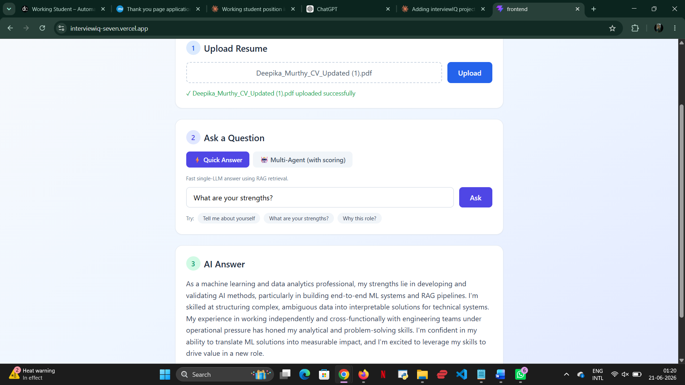

# InterviewIQ 🎯

An AI-powered interview preparation assistant that generates resume-aware answers to interview questions using Retrieval-Augmented Generation (RAG) and multi-agent scoring.

🚀 **Live Demo:** https://interviewiq-seven.vercel.app

---

## What It Does

1. **Upload your resume** (PDF) — the system parses and indexes it
2. **Ask an interview question** — e.g. "What are your strengths?" or "Tell me about yourself"
3. **Choose your mode:**
   - ⚡ **Quick Answer** — Fast single-LLM response using RAG retrieval from your resume
   - 🤖 **Multi-Agent (with scoring)** — Multiple agents generate and evaluate the answer with a quality score

---

## Tech Stack

| Layer | Technology |
|-------|-----------|
| Frontend | React, Tailwind CSS |
| Backend | FastAPI, Python |
| RAG Pipeline | FAISS, LangChain |
| LLM | OpenAI API |
| Deployment | Vercel (frontend), Render (backend) |

---

## Architecture
PDF Resume → Parser → FAISS Vector Index

↓

Interview Question → RAG Retrieval → LLM → Answer

↓

Multi-Agent Scoring (optional)


---

## Features

- Resume-aware answer generation (answers reference YOUR experience)
- Dual mode: fast RAG vs. multi-agent pipeline
- Suggested prompts for common interview questions
- Clean, minimal UI

---

## Run Locally

```bash
# Backend
cd backend
pip install -r requirements.txt
uvicorn main:app --reload

# Frontend
cd frontend
npm install
npm run dev
```

---

## License
MIT
